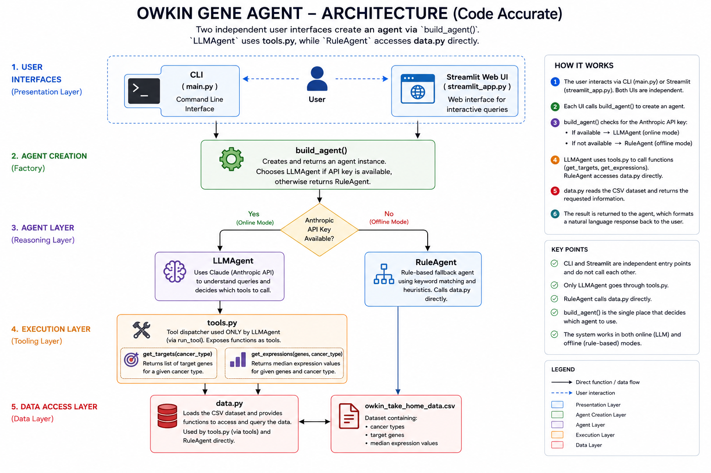

# Owkin Gene-Expression Assistant

A small command-line assistant that lets someone ask, in plain English, about
the genes involved in different cancers and their median expression values. It
answers by calling two data functions and replying in natural language.

Example questions it handles:

- How can you help me?
- What are the main genes involved in lung cancer?
- What is the median expression of genes involved in breast cancer?
- What is the median expression of genes involved in esophageal cancer?
  (esophageal is not in the data, so it says so instead of failing)

## How to run

Needs Python 3.10+ and Git. No GPU, very little RAM. All commands work the same
on Windows, Mac and Linux.

### Step 1. Get the code

If you have Git:

```bash
git clone https://github.com/Praveen7477/owkin-gene-agent.git
cd owkin-gene-agent
```

Or download the ZIP, unzip it, and open a terminal inside the folder.

### Step 2. Create an environment and install the dependencies

**Option A - Anaconda (recommended if you have it):**

```bash
conda create -n owkin python=3.10
conda activate owkin
pip install -r requirements.txt
```

**Option B - plain Python:**

Create the environment:

```bash
python -m venv .venv
```

Activate it (the command is different per operating system):

```bash
source .venv/bin/activate     # Mac / Linux
.venv\Scripts\activate        # Windows (Command Prompt or PowerShell)
```

Then install the packages:

```bash
pip install -r requirements.txt
```

> Note: the `pip install` step downloads several packages (pandas, anthropic,
> streamlit) and can take about **3-5 minutes** the first time. Let it finish.

### Step 3. Run in offline mode (no API key needed)

This works straight away. Start an interactive chat:

```bash
python main.py --offline
```

Type a question, or `exit` to quit. Or ask a single question and exit:

```bash
python main.py --offline -q "What are the main genes involved in lung cancer?"
python main.py --offline -q "What is the median expression of genes involved in breast cancer?"
python main.py --offline -q "What is the median expression of genes involved in esophageal cancer?"
```

### Step 4. Run in online mode (uses Claude, needs an API key)

1. Get an API key from https://console.anthropic.com (API Keys -> Create Key).

2. Copy the template file to `.env`:

   ```bash
   cp .env.example .env       # Mac / Linux
   copy .env.example .env     # Windows (Command Prompt / PowerShell)
   ```

   Or do it manually: make a copy of `.env.example` and rename the copy to
   `.env`.

3. Open `.env` in a text editor and paste your key (no quotes, no spaces):

   ```
   ANTHROPIC_API_KEY=sk-ant-api03-your-key-here
   ```

4. Run **without** `--offline`:

   ```bash
   python main.py
   python main.py -q "What is the median expression of genes involved in breast cancer?"
   ```

The first line printed tells you which mode is active:

- `Using Claude (...)` - online mode (key found)
- `Offline rule-based mode (no ANTHROPIC_API_KEY)` - offline (no key)

**Why use the LLM (online mode)?** The offline agent only matches keywords, so it
breaks on anything phrased differently ("breast tumours" instead of "breast
cancer", typos, comparisons). In online mode Claude understands the question the
way a person would, decides which tools to call and in what order, handles
follow-ups like "compare lung and breast" or "only genes above 0.5", and writes a
clear natural-language answer. That reasoning is what makes it *agentic* - the LLM
is the brain, while the tools keep every fact grounded in the dataset so it can't
invent values. The offline mode stays as a fallback so the app still runs with no
key or internet.

### Step 5. Run the web interface (Streamlit)

```bash
streamlit run streamlit_app.py
```

It opens in the browser. It works in both modes; if a key is set you can switch
between offline and Claude with the "Offline mode" checkbox in the sidebar.

### Step 6. Run the tests

```bash
python -m pytest -q
```

(Plain `pytest -q` also works.) The tests run offline and cover the four
required questions.

### Docker (optional)

```bash
docker build -t owkin-agent .
docker run -it --env-file .env owkin-agent
```

## Design



Four small parts, each doing one job:

- `src/data.py` - reads the CSV, `get_targets` / `get_expressions`.
- `src/tools.py` - wraps those as tools with JSON schemas for the model.
- `src/agent.py` - `LLMAgent` (Claude) and `RuleAgent` (offline).
- `src/cli.py` - the terminal interface.

Flow: the question goes to the agent, the agent calls the tools, the tools read
the data. For "expression of genes in breast cancer", the agent calls
`get_targets` and then `get_expressions`.

There are three tools: `list_cancers`, `get_targets`, `get_expressions`. I added
`list_cancers` so the assistant can answer "how can you help me" and suggest
options when a cancer is missing.

One change from the functions in the brief: the original `get_expressions`
matched genes across the whole table. Since a gene like TP53 appears in several
cancers with different values, that mixes them up. I scoped the lookup to one
cancer so each value is correct.

## About the AI part

In LLM mode, Claude is only used to understand the question, pick which tools to
call, and write the final answer. It is told not to use its own biology
knowledge, so all facts come from the dataset. This keeps it from making up gene
values.

I used tool calling instead of pasting the whole CSV into the prompt. The file
is small so a big prompt would work, but tool calling keeps the data as the
source of truth and stops the model inventing numbers.

Model: `claude-sonnet-5` by default (set `OWKIN_MODEL` to change it; a cheaper
model like Haiku is fine for this). Nothing runs locally, so there is no GPU
dependency. The trade-off is that LLM mode needs an API key and internet, which
is why I added the offline mode as a fallback.

## Notes on using AI-assisted coding

I used a coding assistant to help build this. What worked well: it was fast for
boilerplate (argument parsing, tool schemas, tests) which left more time for the
design. It also helped me think of edge cases like the missing esophageal case.

What to watch: the generated code needs checking. It can produce code that looks
right but is wrong, so I ran the app and the tests to confirm the behaviour. It
also tends to add more than needed, so I kept the structure small. For a medical
dataset the main risk is trusting the model to "know" biology, which is exactly
why the design forces every answer through the data.

## Layout

```
owkin-gene-agent/
├── main.py
├── streamlit_app.py
├── requirements.txt
├── owkin_take_home_data.csv
├── .env.example
├── Dockerfile
├── src/
│   ├── data.py
│   ├── tools.py
│   ├── agent.py
│   └── cli.py
└── tests/
    └── test_tools.py
```
